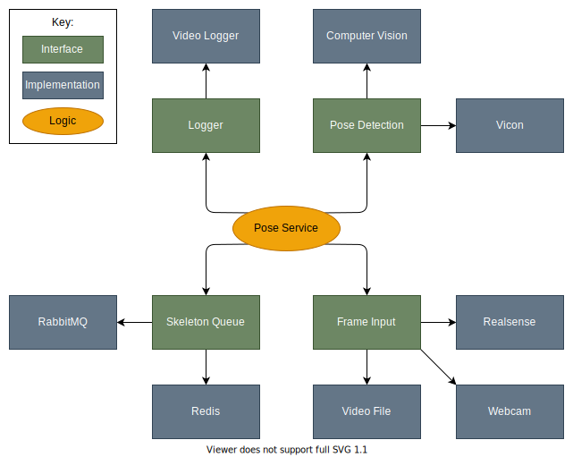

# Real Time Pose

Real Time Pose is a tool created by the wearable computing research group. Headed and advised by Dr. Jason Forsyth. The purpose of the tool is to provide a modular video feedback mechanism that can take a variety of input, process that input with a pose detection model, display the results of the model, and allow researchers to manipulate the displayed results for the purposes of feedback and direction.

In order to use the tool, first ensure that redis messaging service is running. On linux use the following command:
> `sudo systemctl status redis.service`

To see if Redis is running. If not, run:
> `sudo systemctl start redis.service`

To start the program, install the python dependancies listed in the `requirements.txt` file and run:

> `python main.py`

To start the real time pose GUI.

<!-- Next, start the user interface with `start_ui.py` and specify the desired activity. Once the first program is running, run `start_pose.py` with the desired input method. 

`start_pose.py` will fill up a queue with data points that will then be consumed by the front end.

### Example Usage:
> `python start_pose.py --help`

> `python start_ui.py --activity game` 
> `python start_pose.py video webcam` 

> `python start_ui.py --activity game_mk2 --file data/looped/jumping_jacks.csv --hide_demo` 
> `python start_pose.py video --hide_video file --path ./activities/jumping_jacks/demo.mp4`  -->

### Currently Working Activities:
TODO
<!-- * **game** - Two floating buttons that move around randomly.
* **game_mk2** - Actively moving buttons make user replicate dynamic motion. Complete with score tracking and name entering. (requires --file to define motion)
* **bread_crumb** - Buttons that move from one spot to another to guide a user into a defined motion. (requires --file to define motion)
* **haptic** - A single button moving around when clicked. Connects to the haptic golf glove to deliver feedback based on the button direction.
* **shapes** - Six triangles followed by six rectangles followed by six circles (requires --file to define motion(data/looped/shapes.csv))
* **vector_haptic** - Pairs with haptic glove to deliver haptic feedback and direct a user to move their hand to randomly generated points. -->

## Modules

The following are main modules that comprise the project. Each can be found in a seperate folder.

* activities - Configuration files for setting up an activity (or "mode" of the program, if you will)
* constants 
* data_logging - Different kinds of data loggers for collecting information during an activity
* feedback - Modules used to deliver feedback to a user
* frame_input - Inputs in the form of RGB video frames 
* pose_detection - Methods of getting a user's pose and creating a skeleton of points
* skeleton_queue - Storing and sending a user's skeleton points for use elsewhere
* ui - Frontend frameworks and reusable components for user interaction
* utils - Commonly needed functions across all programs

## Project Architecture
The project is laid out in a [hexagonal architecture](https://en.wikipedia.org/wiki/Hexagonal_architecture_(software)) in an attempt to achieve the lowest amount of [coupling](https://en.wikipedia.org/wiki/Coupling_%28computer_programming%29) possible. This allows frame inputs, pose detection algorithms, and frontends to be swapped seamlessly as they do not depend on each other. This design choice was made in an effort to future-proof the tool in the event that new algorithms or feedback approaches are released or pursued.

The architecture of `pose_service.py` can be seen below:

## Data Flow

The main stages of the program's data flow include the creation of a skeleton, the storage/transmission of the skeleton, and the interpretation of the skeleton resulting in feedback.

A diagram of this data flow can be seen below. 

